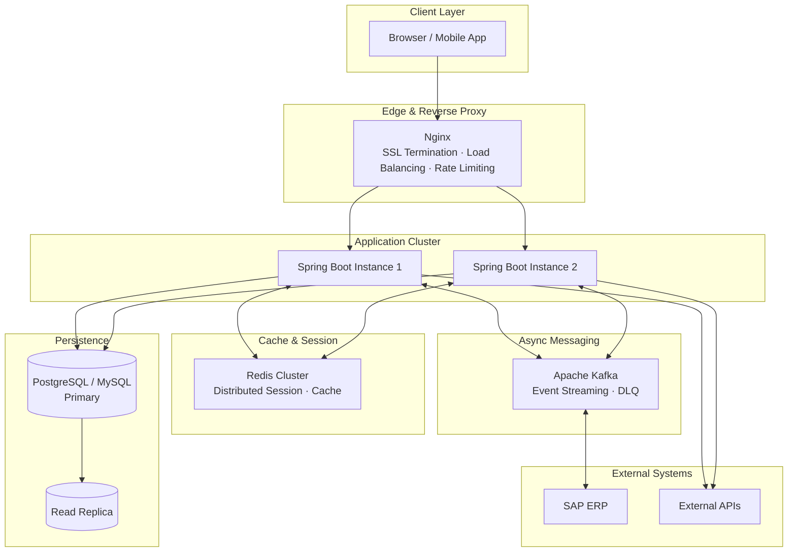
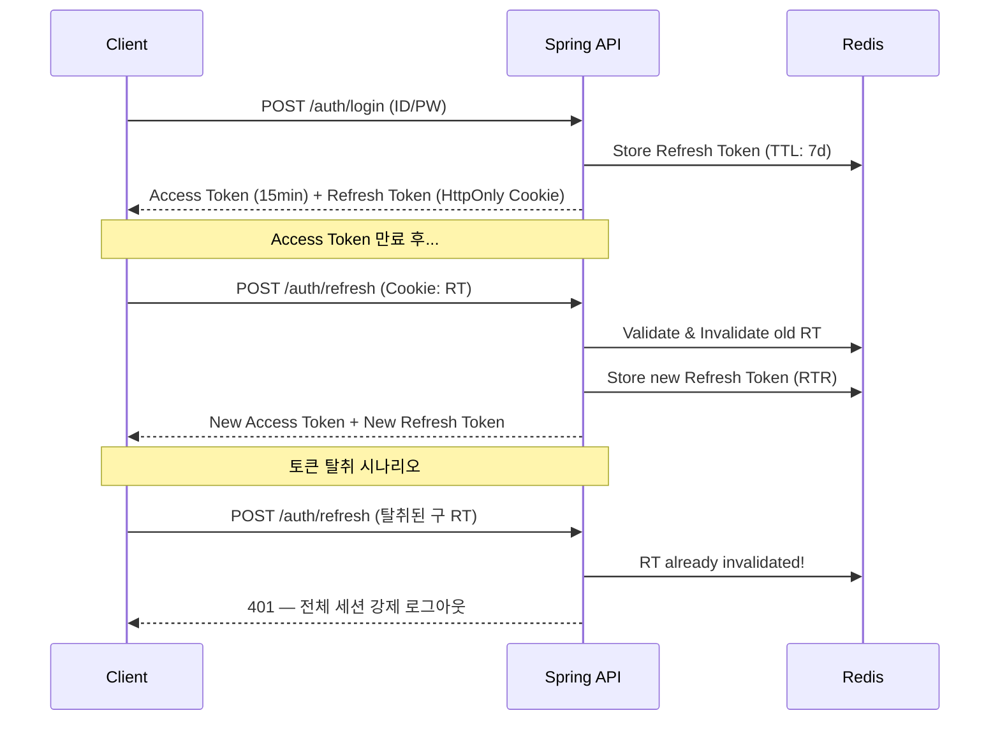
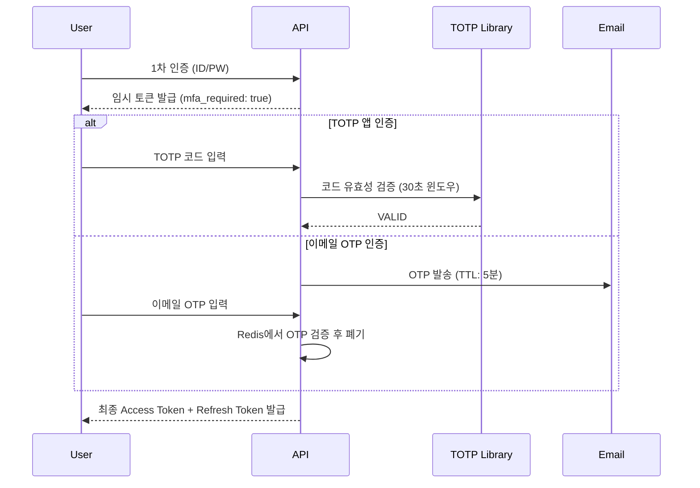
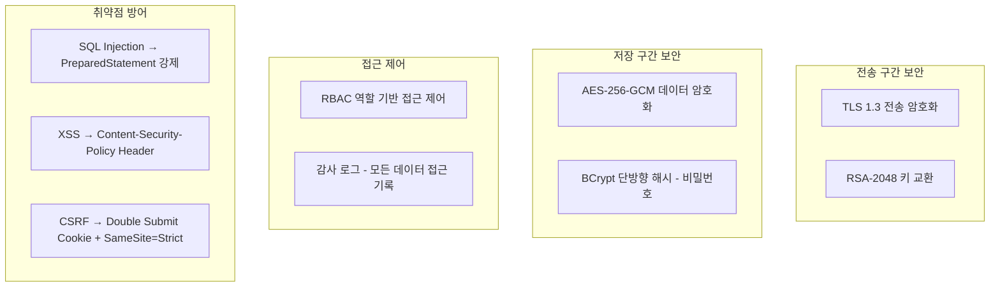
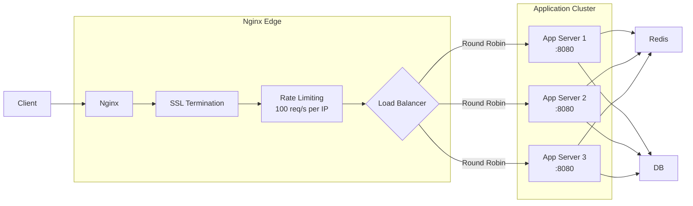
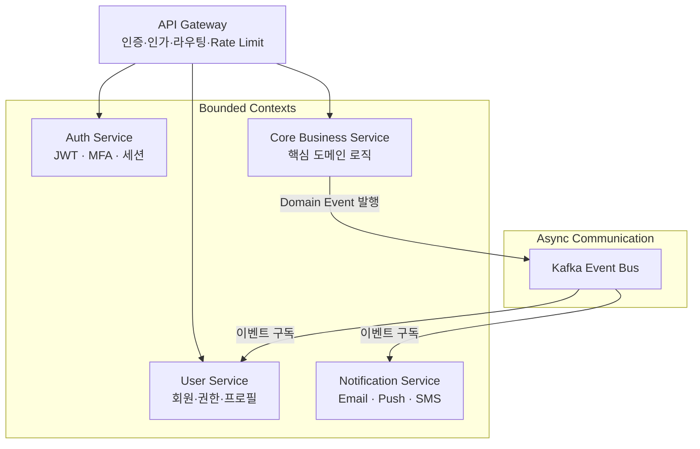

# 🔬 Spring Clean Architecture Lab

> **"좋은 아키텍처는 기술 교체 비용을 0에 가깝게 만든다."**
> 
> 본 저장소는 엔터프라이즈 현장에서 실제로 마주치는 문제들(보안, MSA, 대용량 처리, 배포 자동화)에 대한 **설계 철학과 구현 전략**을 기록한 기술 연구소입니다.

---

## 📐 Architecture Overview

### Hexagonal (Clean) Architecture

의존성 규칙(Dependency Rule)을 엄격히 준수합니다. 비즈니스 핵심 로직(Domain)은 외부 기술(Spring, JPA, DB)에 절대 의존하지 않습니다.

```
┌──────────────────────────────────────────────────────┐
│                   Presentation Layer                  │
│           (REST Controller / DTO Mapping)             │
├──────────────────────────────────────────────────────┤
│                  Application Layer                    │
│     (Use Case / Port Interface / Service Facade)      │
├──────────────────────────────────────────────────────┤
│                    Domain Layer                       │
│        (Entity / Value Object / Domain Event)         │
│           ← 외부 의존성 ZERO, 순수 Java만 사용 →         │
├──────────────────────────────────────────────────────┤
│                Infrastructure Layer                   │
│      (JPA Adapter / Redis Adapter / Kafka Adapter)    │
└──────────────────────────────────────────────────────┘
```

### 전체 시스템 아키텍처



---

## 🔒 Security Strategies

### 1. JWT (JSON Web Token) 전략

단순 JWT 발급을 넘어, **토큰 탈취에 대응하는 RTR(Refresh Token Rotation)** 전략을 적용합니다.



**핵심 설계 포인트:**
- Access Token: 짧은 유효기간(15분), 메모리에만 보관 (localStorage ❌)
- Refresh Token: HttpOnly Cookie + Redis 저장 (XSS 방어)
- RTR: Refresh Token 사용 시 즉시 폐기 후 신규 발급 (재사용 감지)

### 2. MFA (Multi-Factor Authentication) 전략

금융권 표준에 맞는 **TOTP 기반 2단계 인증** 플로우입니다.



### 3. ISMS-P 준수 보안 아키텍처



**ISMS-P 핵심 통제 항목:**
| 항목 | 구현 방식 |
|------|----------|
| 개인정보 암호화 | AES-256-GCM (저장) + RSA-2048 (전송) |
| 접근 통제 | Spring Security + RBAC + IP 화이트리스트 |
| 감사 추적 | AOP 기반 감사 로그 (who / when / what / from where) |
| 취약점 관리 | OWASP Top 10 기준 정기 점검 |

---

## 🌐 Infrastructure & Nginx

### Nginx 리버스 프록시 + 로드밸런싱



**로드밸런싱 전략 비교:**
| 전략 | 사용 시나리오 |
|------|-------------|
| Round Robin (기본) | 서버 스펙이 동일한 경우 |
| Least Connection | 요청 처리 시간 편차가 큰 경우 |
| IP Hash | 세션 고정이 필요한 레거시 연동 |

**핵심 Nginx 설정 포인트:**
```nginx
upstream backend {
    least_conn;                         # Least Connection 전략
    server app1:8080 weight=1;
    server app2:8080 weight=1;
    keepalive 32;                       # 커넥션 재사용
}

server {
    listen 443 ssl http2;
    ssl_protocols TLSv1.3;             # TLS 1.3만 허용

    # Rate Limiting
    limit_req zone=api burst=20 nodelay;

    # Security Headers
    add_header X-Frame-Options DENY;
    add_header X-Content-Type-Options nosniff;
    add_header Content-Security-Policy "default-src 'self'";

    location /api/ {
        proxy_pass http://backend;
        proxy_set_header X-Real-IP $remote_addr;
    }
}
```

---

## 🧩 MSA Design Patterns

### 서비스 분리 전략 (Domain-Driven Boundary)



**서비스 분리 원칙:**
- 하나의 Bounded Context = 하나의 서비스 (DDD)
- 서비스 간 직접 DB 접근 절대 금지 → 이벤트/API로만 통신
- 동기 통신(REST): 즉각 응답이 필요한 경우
- 비동기 통신(Kafka): 느슨한 결합이 필요한 경우 (알림, 통계 등)

---

## 🚀 CI/CD Pipeline

### GitHub Actions 기반 전체 파이프라인

```mermaid
graph LR
    Push[Git Push to dev] --> Trigger

    subgraph "CI Pipeline"
        Trigger[Trigger] --> Build[🔨 Gradle Build]
        Build --> Test[✅ Unit + Integration Test]
        Test --> Security[🔒 Dependency Vulnerability Scan]
        Security --> Lint[📐 Code Quality Check]
    end

    subgraph "CD Pipeline - Staging"
        Lint -->|PR to main| Docker[🐳 Docker Build & Push]
        Docker --> Deploy_STG[🚀 Deploy to Staging]
        Deploy_STG --> E2E[🧪 E2E Test]
    end

    subgraph "CD Pipeline - Production"
        E2E -->|Manual Approve| Deploy_PRD[🚀 Deploy to Production]
        Deploy_PRD --> Health[❤️ Health Check]
        Health -->|Fail| Rollback[⏪ Auto Rollback]
    end
```



**브랜치 전략과 파이프라인 매핑:**
| 브랜치 | 트리거 | 실행 작업 |
|--------|--------|----------|
| `feat/*` | Push | Build + Test |
| `dev` | PR Merge | Build + Test + Security Scan + Staging Deploy |
| `main` | PR Merge (+ 수동 승인) | Full Pipeline + Production Deploy |

---

## 📐 ADR (Architecture Decision Records)

### ADR-001: 클린 아키텍처 채택 이유

**결정**: 헥사고날(포트 & 어댑터) 아키텍처 적용  
**이유**: 5년 이상 운영되는 엔터프라이즈 시스템에서 DB 교체(Oracle → PostgreSQL) 또는 프레임워크 업그레이드 시 비즈니스 로직 변경 비용을 0에 수렴시키기 위함  
**결과**: Domain Layer는 Spring, JPA에 대한 import 0건 유지

### ADR-002: Kafka vs RabbitMQ 선택

**결정**: Apache Kafka 채택  
**이유**: 이벤트 재처리(Replay), 고처리량(SAP ERP 연동), Consumer Group 기반 확장이 필요한 물류 도메인 특성상 RabbitMQ보다 적합  
**결과**: 일 최대 500만 건 이벤트 처리 안정성 확보

---

## 🌿 Branch Strategy

```
main   ─── 배포 가능한 안정 코드 (Protected · PR + 코드 리뷰 필수)
  └── dev ─── 개발 통합 브랜치 (CI 자동 실행)
        ├── feat/jwt-refresh-rotation
        ├── feat/nginx-load-balancer
        └── docs/isms-security-guide
```

---

## 🛠 Tech Stack

| Category | Technologies |
|----------|-------------|
| **Backend** | Java 17, Spring Boot 3.x, Spring Security, JPA/QueryDSL |
| **Database** | PostgreSQL, MySQL, Redis Cluster |
| **Messaging** | Apache Kafka (Exactly-Once, DLQ) |
| **DevOps** | Docker (Multi-stage), GitHub Actions, Nginx |
| **Testing** | JUnit5, AssertJ, Mockito, Testcontainers |
| **Security** | JWT (RTR), TOTP MFA, AES-256, ISMS-P |
